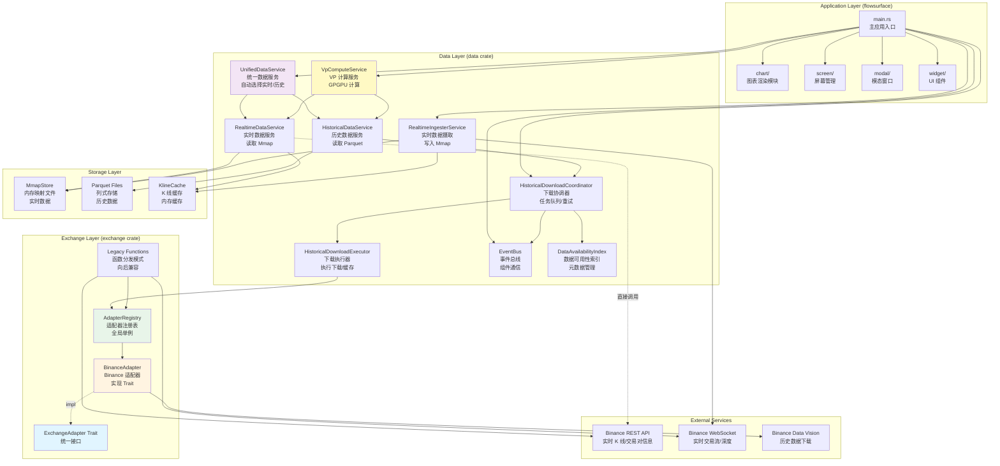

# 完整系统架构图

## 一、整体架构概览（Mermaid 图表）



## 二、详细架构图（ASCII）

```
┌─────────────────────────────────────────────────────────────────────────────┐
│                        Application Layer (flowsurface)                      │
│                                                                              │
│  ┌──────────────────────────────────────────────────────────────────────┐  │
│  │  main.rs                                                              │  │
│  │  - 应用入口和消息循环                                                  │  │
│  │  - 窗口管理                                                            │  │
│  │  - 服务初始化                                                          │  │
│  └────────────┬───────────────────────────────┬──────────────────────────┘  │
│               │                               │                             │
│  ┌────────────▼──────────┐      ┌────────────▼──────────────┐             │
│  │  screen/               │      │  chart/                   │             │
│  │  - Dashboard           │      │  - KlineChart            │             │
│  │  - Sidebar             │      │  - HeatmapChart          │             │
│  │  - HistoricalDataStatus│      │  - SVP Renderer          │             │
│  │    Window              │      │  - Indicator System      │             │
│  └───────────────────────┘      └──────────────────────────┘             │
│                                                                              │
│  ┌──────────────────────────────────────────────────────────────────────┐  │
│  │  modal/                                                               │  │
│  │  - LayoutManager                                                      │  │
│  │  - ThemeEditor                                                        │  │
│  │  - AudioSettings                                                      │  │
│  └──────────────────────────────────────────────────────────────────────┘  │
│                                                                              │
│  ┌──────────────────────────────────────────────────────────────────────┐  │
│  │  widget/                                                              │  │
│  │  - Chart Widgets                                                      │  │
│  │  - Toast Notifications                                                │  │
│  │  - Tooltips                                                           │  │
│  └──────────────────────────────────────────────────────────────────────┘  │
└───────────────────────────────┬─────────────────────────────────────────────┘
                                │
                                ▼
┌─────────────────────────────────────────────────────────────────────────────┐
│                          Data Layer (data crate)                            │
│                                                                              │
│  ┌──────────────────────────────────────────────────────────────────────┐  │
│  │  UnifiedDataService                                                  │  │
│  │  - 统一数据接口                                                       │  │
│  │  - 自动选择实时/历史数据源                                             │  │
│  │  - 动态 safe_cutoff 计算                                              │  │
│  └────────────┬───────────────────────┬──────────────────────────────────┘  │
│               │                       │                                     │
│  ┌────────────▼──────────┐  ┌─────────▼──────────────┐                    │
│  │  RealtimeDataService  │  │  HistoricalDataService │                    │
│  │  - 读取 Mmap 文件     │  │  - 读取 Parquet 缓存   │                    │
│  │  - 实时 K 线聚合       │  │  - 触发下载任务        │                    │
│  │  - 缓存管理            │  │  - 合并多日期数据      │                    │
│  └────────────┬──────────┘  └──────────┬─────────────┘                    │
│               │                        │                                   │
│  ┌────────────▼──────────┐  ┌──────────▼─────────────┐                    │
│  │  RealtimeIngester     │  │  HistoricalDownload    │                    │
│  │  Service              │  │  Coordinator           │                    │
│  │  - WebSocket 接收      │  │  - 任务队列管理        │                    │
│  │  - 写入 Mmap           │  │  - 重试逻辑             │                    │
│  │  - K 线聚合            │  │  - 状态更新            │                    │
│  └────────────┬──────────┘  └──────────┬─────────────┘                    │
│               │                        │                                   │
│               │            ┌───────────▼─────────────┐                    │
│               │            │  HistoricalDownload     │                    │
│               │            │  Executor               │                    │
│               │            │  - 执行下载              │                    │
│               │            │  - 缓存管理              │                    │
│               │            │  - 数据转换              │                    │
│               │            └───────────┬─────────────┘                    │
│               │                        │                                   │
│  ┌────────────▼──────────┐  ┌───────────▼─────────────┐                    │
│  │  VpComputeService     │  │  EventBus               │                    │
│  │  - GPGPU 计算          │  │  - 统一事件系统          │                    │
│  │  - WGPU Pipeline       │  │  - 发布/订阅模式         │                    │
│  │  - 分块处理            │  └────────────────────────┘                    │
│  └───────────────────────┘                                                    │
│                                                                              │
│  ┌──────────────────────────────────────────────────────────────────────┐  │
│  │  DataAvailabilityIndex                                                │  │
│  │  - 数据可用性元数据                                                    │  │
│  │  - 状态跟踪（Available/Downloading/Unavailable）                       │  │
│  └──────────────────────────────────────────────────────────────────────┘  │
└───────────────────────────────┬─────────────────────────────────────────────┘
                                │
                                │ 通过 AdapterRegistry
                                ▼
┌─────────────────────────────────────────────────────────────────────────────┐
│                      Exchange Layer (exchange crate)                        │
│                                                                              │
│  ┌──────────────────────────────────────────────────────────────────────┐  │
│  │  ExchangeAdapter (Trait)                                             │  │
│  │  - fetch_klines()                                                     │  │
│  │  - fetch_historical_data()                                           │  │
│  │  - fetch_ticker_info()                                               │  │
│  │  - fetch_ticker_prices()                                             │  │
│  │  - fetch_historical_oi()                                             │  │
│  │  - rate_limiter()                                                    │  │
│  └──────────────────────────────────────────────────────────────────────┘  │
│                            ▲                                                  │
│                            │ impl                                             │
│  ┌────────────────────────┴────────────────────────────────────────────┐    │
│  │                                                                       │    │
│  │  ┌──────────────────────────────────────────────────────────────┐  │    │
│  │  │  BinanceAdapter                                               │  │    │
│  │  │  - 实现 ExchangeAdapter trait                                  │  │    │
│  │  │  - download_kline_from_data_vision()                         │  │    │
│  │  │  - download_ticks_from_data_vision()                          │  │    │
│  │  │  - 使用 BinanceLimiter 进行速率限制                           │  │    │
│  │  └──────────────────────────────────────────────────────────────┘  │    │
│  │                                                                       │    │
│  │  ┌──────────────────────────────────────────────────────────────┐  │    │
│  │  │  AdapterRegistry (全局单例)                                   │  │    │
│  │  │  - 管理所有 ExchangeAdapter 实例                              │  │    │
│  │  │  - 根据 Exchange 类型返回对应的 Adapter                        │  │    │
│  │  │  - global() 静态方法提供全局访问                              │  │    │
│  │  └──────────────────────────────────────────────────────────────┘  │    │
│  │                                                                       │    │
│  └───────────────────────────────────────────────────────────────────────┘    │
│                                                                              │
│  ┌──────────────────────────────────────────────────────────────────────┐  │
│  │  Legacy Functions (函数分发模式)                                     │  │
│  │  - fetch_klines() → 内部使用 Trait 模式（Binance）                  │  │
│  │  - fetch_ticker_info() → 内部使用 Trait 模式（Binance）             │  │
│  │  - fetch_ticker_prices() → 内部使用 Trait 模式（Binance）            │  │
│  │  - fetch_open_interest() → 内部使用 Trait 模式（Binance）            │  │
│  │  - WebSocket 连接逻辑（仍使用 Legacy）                               │  │
│  └──────────────────────────────────────────────────────────────────────┘  │
│                                                                              │
└───────────────────────────────┬─────────────────────────────────────────────┘
                                │
                                │ HTTP/WebSocket
                                ▼
┌─────────────────────────────────────────────────────────────────────────────┐
│                        External Services                                     │
│  - Binance REST API (实时 K 线、交易对信息)                                   │
│  - Binance WebSocket (实时交易流、深度数据)                                   │
│  - Binance Data Vision (历史数据下载)                                        │
└─────────────────────────────────────────────────────────────────────────────┘
                                │
                                ▼
┌─────────────────────────────────────────────────────────────────────────────┐
│                        Storage Layer                                         │
│                                                                              │
│  ┌──────────────────────────────────────────────────────────────────────┐  │
│  │  MmapStore (实时数据)                                                 │  │
│  │  - 内存映射文件                                                       │  │
│  │  - 零拷贝访问                                                         │  │
│  │  - 高性能读写                                                         │  │
│  │  - 文件格式: {symbol}.mmap                                            │  │
│  └──────────────────────────────────────────────────────────────────────┘  │
│                                                                              │
│  ┌──────────────────────────────────────────────────────────────────────┐  │
│  │  Parquet Files (历史数据)                                             │  │
│  │  - 列式存储格式                                                       │  │
│  │  - 高效压缩                                                           │  │
│  │  - 文件格式:                                                          │  │
│  │    - {symbol}_{date}_ticks.parquet                                  │  │
│  │    - {symbol}_{date}_{timeframe}.parquet                             │  │
│  └──────────────────────────────────────────────────────────────────────┘  │
│                                                                              │
│  ┌──────────────────────────────────────────────────────────────────────┐  │
│  │  KlineCache (内存缓存)                                                │  │
│  │  - 内存中的 K 线缓存                                                  │  │
│  │  - 快速访问                                                           │  │
│  │  - 减少 API 调用                                                      │  │
│  └──────────────────────────────────────────────────────────────────────┘  │
└─────────────────────────────────────────────────────────────────────────────┘
```

## 三、数据流向图

### 3.1 实时数据流

```
Binance WebSocket
    │
    ▼
RealtimeIngesterService
    │
    ├─► 解析交易数据
    │
    ├─► 写入 MmapStore ({symbol}.mmap)
    │
    └─► 更新 KlineCache
        │
        ▼
RealtimeDataService::fetch_klines_blocking()
    │
    ├─► 从 KlineCache 读取（优先）
    │
    └─► 缓存未命中 → 直接调用 Binance REST API ⚠️
        │
        └─► 手动解析 JSON → 返回 KLine
```

### 3.2 历史数据流

```
User Request (需要历史数据)
    │
    ▼
UnifiedDataService::fetch_klines()
    │
    ├─► 计算 safe_cutoff
    │
    ├─► 时间范围 < safe_cutoff？
    │   │
    │   ├─► 是 → HistoricalDataService
    │   │       │
    │   │       ├─► 检查 Parquet 缓存
    │   │       │   │
    │   │       ├─► 缓存命中 → 直接返回
    │   │       │
    │   │       └─► 缓存未命中 → HistoricalDownloadCoordinator::submit_task()
    │   │                           │
    │   │                           ▼
    │   │                   HistoricalDownloadExecutor
    │   │                           │
    │   │                           ▼
    │   │                   AdapterRegistry::global()
    │   │                           │
    │   │                           ▼
    │   │                   BinanceAdapter::fetch_historical_data()
    │   │                           │
    │   │                           ▼
    │   │                   Binance Data Vision (HTTP)
    │   │                           │
    │   │                           ▼
    │   │                   下载 ZIP → 解析 CSV → 保存 Parquet
    │   │
    │   └─► 否 → RealtimeDataService
    │           │
    │           └─► 从 MmapStore 读取
```

### 3.3 VP 计算流

```
User Request (计算 VP)
    │
    ▼
Flowsurface::update(Message::ComputeVp)
    │
    ▼
UnifiedDataService::fetch_ticks()
    │
    ├─► 获取 Tick 数据（实时或历史）
    │
    └─► VpComputeService::compute_vp()
        │
        ├─► 准备 GPU 资源
        │
        ├─► 上传数据到 GPU
        │
        ├─► 执行 Compute Shader
        │   │
        │   ├─► 如果数据量大 → 分块处理
        │   │
        │   └─► 聚合价格-成交量
        │
        └─► 下载结果 → VolumeProfile
```

## 四、核心模块详细说明

### 4.1 Application Layer (flowsurface)

```
flowsurface/
├── src/
│   ├── main.rs
│   │   └── Flowsurface
│   │       ├── 应用状态管理
│   │       ├── 消息循环
│   │       ├── 窗口管理
│   │       └── 服务初始化
│   │
│   ├── chart/
│   │   ├── kline.rs - K 线图表
│   │   ├── heatmap.rs - 热力图
│   │   ├── svp_renderer.rs - S-VP 渲染器
│   │   ├── indicator/ - 指标系统
│   │   │   ├── kline/ - K 线指标
│   │   │   └── plot/ - 绘图指标
│   │   └── shaders/ - WGSL 着色器
│   │
│   ├── screen/
│   │   ├── dashboard.rs - 主仪表板
│   │   ├── dashboard/ - 仪表板组件
│   │   │   ├── pane.rs - 窗格管理
│   │   │   ├── panel/ - 面板类型
│   │   │   │   ├── ladder.rs - DOM/Ladder
│   │   │   │   └── timeandsales.rs - 时间与销售
│   │   │   └── sidebar.rs - 侧边栏
│   │   └── historical_data_status/ - 历史数据状态窗口
│   │
│   ├── modal/ - 模态窗口
│   │   ├── layout_manager.rs - 布局管理
│   │   ├── theme_editor.rs - 主题编辑
│   │   └── audio.rs - 音频设置
│   │
│   └── widget/ - UI 组件
│       ├── chart.rs - 图表组件
│       ├── toast.rs - 通知
│       └── vp_renderer.rs - VP 渲染器
```

### 4.2 Data Layer (data crate)

```
data/
├── src/
│   ├── unified_data_service.rs
│   │   └── UnifiedDataService
│   │       ├── fetch_klines() - 统一 K 线接口
│   │       ├── fetch_ticks() - 统一 Tick 接口
│   │       └── 自动选择实时/历史数据源
│   │
│   ├── realtime_data_service.rs
│   │   └── RealtimeDataService
│   │       ├── fetch_klines_blocking() - 读取实时 K 线
│   │       ├── fetch_ticks_blocking() - 读取实时 Tick
│   │       └── 从 MmapStore 读取
│   │
│   ├── realtime_ingester.rs
│   │   └── RealtimeIngesterService
│   │       ├── WebSocket 接收
│   │       ├── 写入 MmapStore
│   │       └── K 线聚合
│   │
│   ├── historical_data_service.rs
│   │   └── HistoricalDataService
│   │       ├── fetch_klines() - 读取历史 K 线
│   │       ├── fetch_ticks() - 读取历史 Tick
│   │       └── 触发下载任务
│   │
│   ├── historical_download_coordinator.rs
│   │   └── HistoricalDownloadCoordinator
│   │       ├── 任务队列管理
│   │       ├── 重试逻辑
│   │       └── 状态更新
│   │
│   ├── historical_download_executor.rs
│   │   └── HistoricalDownloadExecutor
│   │       ├── download_and_cache_kline()
│   │       ├── download_and_cache_ticks()
│   │       └── 通过 AdapterRegistry 获取数据
│   │
│   ├── compute/
│   │   ├── service.rs - VpComputeService
│   │   ├── vp.rs - VP 计算管道
│   │   └── vp_compute.wgsl - Compute Shader
│   │
│   ├── event_bus.rs
│   │   └── EventBus
│   │       ├── 发布事件
│   │       └── 订阅事件
│   │
│   └── data_availability_index.rs
│       └── DataAvailabilityIndex
│           └── 数据可用性元数据
```

### 4.3 Exchange Layer (exchange crate)

```
exchange/
├── src/
│   ├── adapter.rs
│   │   ├── ExchangeAdapter (Trait)
│   │   ├── AdapterRegistry
│   │   ├── HistoricalDataType
│   │   ├── HistoricalData
│   │   └── Legacy Functions (包装 Trait)
│   │
│   ├── adapter/binance.rs
│   │   └── BinanceAdapter
│   │       ├── impl ExchangeAdapter
│   │       └── 历史数据下载逻辑
│   │
│   ├── adapter/bybit.rs
│   ├── adapter/hyperliquid.rs
│   └── adapter/okex.rs
│
│   ├── connect.rs - WebSocket 连接
│   ├── depth.rs - 深度数据
│   ├── fetcher.rs - 数据获取
│   └── limiter.rs - 速率限制
```

### 4.4 Storage Layer

```
storage/
└── src/
    └── lib.rs
        └── MmapStore
            ├── 内存映射文件
            └── 高性能读写
```

## 五、关键数据流

### 5.1 K 线数据流

```
实时数据:
  Binance WebSocket
    → RealtimeIngesterService
    → MmapStore
    → RealtimeDataService
    → UnifiedDataService
    → Chart

历史数据:
  User Request
    → UnifiedDataService
    → HistoricalDataService
    → Parquet Cache (或下载)
    → Chart
```

### 5.2 Tick 数据流（VP 计算）

```
实时数据:
  Binance WebSocket
    → RealtimeIngesterService
    → MmapStore
    → RealtimeDataService
    → VpComputeService
    → VolumeProfile

历史数据:
  User Request
    → UnifiedDataService
    → HistoricalDataService
    → Parquet Cache (或下载)
    → VpComputeService
    → VolumeProfile
```

### 5.3 事件流

```
数据服务
    │
    ▼
EventBus::publish()
    │
    ├─► DownloadStarted
    ├─► DownloadCompleted
    ├─► DownloadFailed
    └─► AvailabilityChanged
        │
        ▼
订阅者（HistoricalDataStatusWindow, 等）
    │
    └─► 更新 UI
```

## 六、技术栈

### 6.1 核心技术

- **GUI 框架**: Iced (基于 WGPU)
- **异步运行时**: Tokio
- **GPU 计算**: WGPU + WGSL
- **数据存储**: 
  - Mmap (实时数据)
  - Parquet (历史数据)
- **网络**: 
  - reqwest (HTTP)
  - fastwebsockets (WebSocket)

### 6.2 架构模式

- **Trait 模式**: ExchangeAdapter (统一接口)
- **事件驱动**: EventBus (组件通信)
- **Lambda 架构**: 实时层 + 批处理层
- **统一数据服务**: 自动选择数据源

## 七、当前架构状态

### 7.1 已统一到 Trait 模式 ✅

- ✅ 历史数据下载（Binance）
- ✅ REST API 调用（Binance，通过 Legacy 函数包装）

### 7.2 未统一到 Trait 模式 ❌

- ❌ 实时数据获取（RealtimeDataService 直接调用 HTTP API）
- ❌ WebSocket 连接（仍使用 Legacy 函数）

### 7.3 架构特点

- ✅ **统一接口**: ExchangeAdapter trait
- ✅ **向后兼容**: Legacy 函数作为包装
- ✅ **渐进式迁移**: Binance 已迁移，其他交易所待迁移
- ✅ **事件驱动**: EventBus 统一事件系统
- ✅ **高性能**: GPGPU 计算，Mmap 零拷贝

## 八、模块依赖关系

```
flowsurface (主应用)
    ├─► data (数据层)
    │   ├─► exchange (交易所层)
    │   │   └─► reqwest, tokio, ...
    │   └─► storage (存储层)
    │
    └─► iced, wgpu, ...

data (数据层)
    ├─► exchange (交易所通信)
    ├─► storage (存储抽象)
    └─► tokio, arrow, parquet, ...

exchange (交易所层)
    └─► reqwest, tokio, fastwebsockets, ...

storage (存储层)
    └─► 标准库 (Mmap)
```

## 九、关键设计决策

1. **Lambda 架构**: 分离实时层和批处理层
2. **统一数据服务**: 自动选择数据源，对上层透明
3. **Trait 模式**: 统一交易所接口，易于扩展
4. **事件驱动**: EventBus 实现组件解耦
5. **GPGPU 计算**: 卸载计算密集型任务到 GPU
6. **零拷贝访问**: Mmap 实现高性能数据访问

