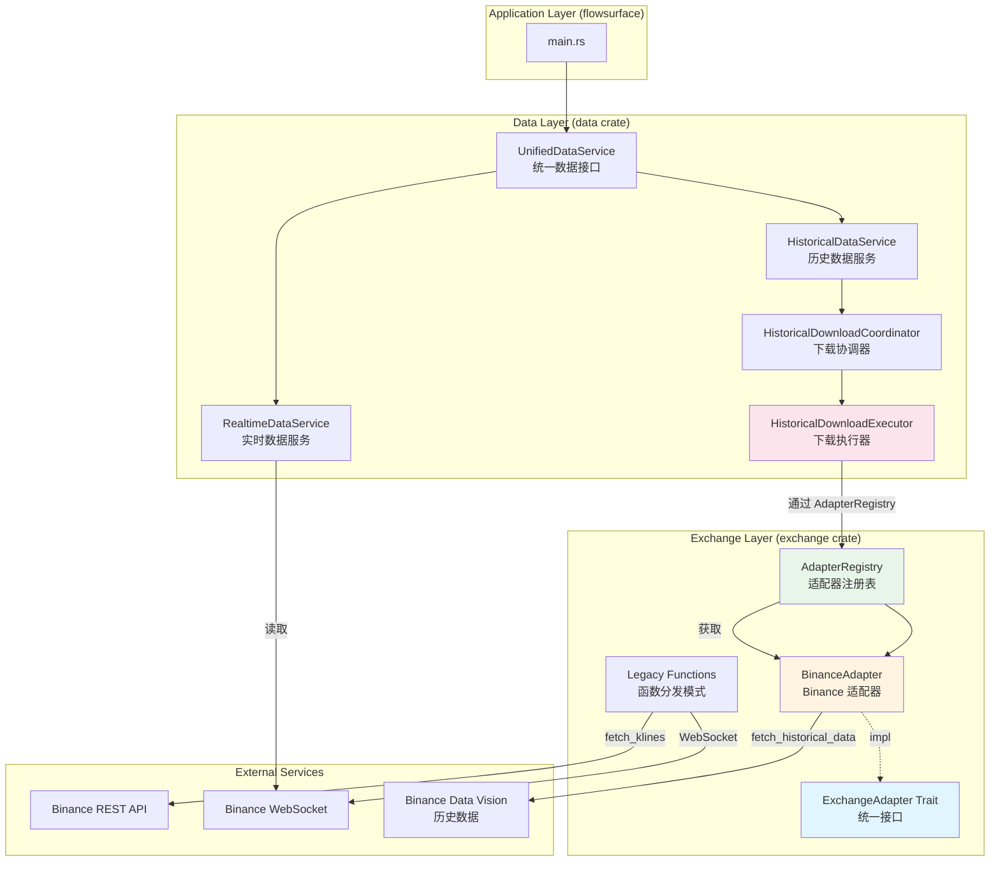

# 当前系统架构图（Trait 模式重构后）

## 一、整体架构概览（Mermaid 图表）



## 二、详细架构概览（ASCII 图表）

```
┌─────────────────────────────────────────────────────────────────┐
│                         Application Layer                        │
│                      (flowsurface/src/main.rs)                   │
└────────────────────────────┬────────────────────────────────────┘
                              │
                              ▼
┌─────────────────────────────────────────────────────────────────┐
│                         Data Layer                                │
│                      (data crate)                                │
│                                                                   │
│  ┌──────────────────────────────────────────────────────────┐  │
│  │         UnifiedDataService                                │  │
│  │  - 统一数据接口，自动选择实时/历史数据源                    │  │
│  └────────────┬───────────────────────┬──────────────────────┘  │
│               │                       │                          │
│  ┌────────────▼──────────┐  ┌─────────▼──────────────┐          │
│  │ RealtimeDataService  │  │ HistoricalDataService │          │
│  │ - WebSocket 实时数据  │  │ - 读取历史数据缓存     │          │
│  └──────────────────────┘  └──────────┬─────────────┘          │
│                                       │                         │
│                            ┌──────────▼─────────────┐          │
│                            │ HistoricalDownload     │          │
│                            │ Coordinator            │          │
│                            │ - 管理下载任务队列      │          │
│                            │ - 重试逻辑             │          │
│                            └──────────┬─────────────┘          │
│                                       │                         │
│                            ┌──────────▼─────────────┐          │
│                            │ HistoricalDownload     │          │
│                            │ Executor               │          │
│                            │ - 执行实际下载          │          │
│                            │ - 缓存管理              │          │
│                            └──────────┬─────────────┘          │
│                                       │                         │
└───────────────────────────────────────┼─────────────────────────┘
                                        │
                                        │ 通过 AdapterRegistry
                                        │ 获取 ExchangeAdapter
                                        ▼
┌─────────────────────────────────────────────────────────────────┐
│                      Exchange Layer                              │
│                    (exchange crate)                              │
│                                                                   │
│  ┌──────────────────────────────────────────────────────────┐  │
│  │              ExchangeAdapter (Trait)                       │  │
│  │  - fetch_klines()                                         │  │
│  │  - fetch_historical_data()                                │  │
│  │  - rate_limiter()                                         │  │
│  └──────────────────────────────────────────────────────────┘  │
│                            ▲                                     │
│                            │ impl                                │
│  ┌─────────────────────────┴──────────────────────────────┐    │
│  │                                                          │    │
│  │  ┌──────────────────────────────────────────────────┐  │    │
│  │  │         BinanceAdapter                           │  │    │
│  │  │  - 实现 ExchangeAdapter trait                    │  │    │
│  │  │  - download_kline_from_data_vision()            │  │    │
│  │  │  - download_ticks_from_data_vision()            │  │    │
│  │  │  - 使用 BinanceLimiter 进行速率限制              │  │    │
│  │  └──────────────────────────────────────────────────┘  │    │
│  │                                                          │    │
│  │  ┌──────────────────────────────────────────────────┐  │    │
│  │  │         AdapterRegistry                          │  │    │
│  │  │  - 管理所有 ExchangeAdapter 实例                  │  │    │
│  │  │  - 根据 Exchange 类型返回对应的 Adapter           │  │    │
│  │  └──────────────────────────────────────────────────┘  │    │
│  │                                                          │    │
│  └──────────────────────────────────────────────────────────┘    │
│                                                                   │
│  ┌──────────────────────────────────────────────────────────┐  │
│  │  Legacy Functions (函数分发模式)                         │  │
│  │  - fetch_klines()                                        │  │
│  │  - fetch_ticker_info()                                   │  │
│  │  - fetch_historical_oi()                                 │  │
│  │  (保留用于向后兼容和实时数据)                             │  │
│  └──────────────────────────────────────────────────────────┘  │
│                                                                   │
└─────────────────────────────────────────────────────────────────┘
                                        │
                                        │ HTTP/WebSocket
                                        ▼
┌─────────────────────────────────────────────────────────────────┐
│                    External Services                             │
│  - Binance API (REST)                                            │
│  - Binance WebSocket                                             │
│  - Binance Data Vision (历史数据)                                 │
└─────────────────────────────────────────────────────────────────┘
```

## 二、数据流向图

### 2.1 历史数据下载流程

```
User Request
    │
    ▼
HistoricalDataService::fetch_ticks()
    │
    ├─► 检查缓存
    │   └─► 如果存在 → 直接返回
    │
    └─► 缓存不存在
        │
        ▼
HistoricalDownloadCoordinator::submit_task()
    │
    ▼
HistoricalDownloadExecutor::download_and_cache_ticks()
    │
    ├─► 再次检查缓存（防止并发下载）
    │
    └─► 通过 AdapterRegistry 获取 BinanceAdapter
        │
        ▼
BinanceAdapter::fetch_historical_data()
    │
    ├─► download_ticks_from_data_vision()
    │   │
    │   ├─► HTTP GET Binance Data Vision
    │   ├─► 下载 ZIP 文件
    │   ├─► 解压并解析 CSV
    │   └─► 返回 Vec<Trade>
    │
    └─► HistoricalDownloadExecutor 转换数据
        │
        ├─► Trade → TickDataBuffer
        │
        └─► 保存到 Parquet 缓存
            │
            └─► 返回给调用者
```

### 2.2 实时数据流程

```
WebSocket Connection
    │
    ▼
Exchange Crate (Legacy Functions)
    │
    ├─► fetch_klines() → Binance REST API
    │
    └─► WebSocket Stream → RealtimeDataService
        │
        └─► 写入 Mmap 文件
```

## 三、核心组件详细说明

### 3.1 Exchange Crate

```
exchange/
├── adapter.rs
│   ├── ExchangeAdapter (Trait)
│   │   ├── fetch_klines()
│   │   ├── fetch_historical_data()
│   │   └── rate_limiter()
│   │
│   ├── AdapterRegistry
│   │   ├── new() - 创建并注册所有 adapters
│   │   ├── get() - 获取 adapter
│   │   └── get_or_err() - 获取 adapter 或返回错误
│   │
│   ├── HistoricalDataType (Enum)
│   │   ├── Kline { timeframe: String }
│   │   └── Tick
│   │
│   └── HistoricalData (Enum)
│       ├── Klines(Vec<Kline>)
│       └── Ticks(Vec<Trade>)
│
└── adapter/binance.rs
    └── BinanceAdapter
        ├── impl ExchangeAdapter
        │   ├── fetch_klines() → 调用 legacy fetch_klines()
        │   ├── fetch_historical_data()
        │   │   ├── Kline → download_kline_from_data_vision()
        │   │   └── Tick → download_ticks_from_data_vision()
        │   └── rate_limiter() → 返回 BinanceLimiter
        │
        └── 私有方法
            ├── download_kline_from_data_vision()
            │   └── HTTP → ZIP → CSV → Vec<Kline>
            │
            └── download_ticks_from_data_vision()
                └── HTTP → ZIP → CSV → Vec<Trade>
```

### 3.2 Data Crate

```
data/
├── historical_download_executor.rs
│   └── HistoricalDownloadExecutor
│       ├── adapter_registry: Arc<AdapterRegistry>
│       ├── download_and_cache_kline()
│       │   ├── 检查缓存
│       │   ├── adapter_registry.get_or_err(Exchange::BinanceSpot)
│       │   ├── adapter.fetch_historical_data()
│       │   ├── 转换 HistoricalData::Klines → Vec<KLine>
│       │   └── 保存到 Parquet
│       │
│       └── download_and_cache_ticks()
│           ├── 检查缓存
│           ├── adapter_registry.get_or_err(Exchange::BinanceSpot)
│           ├── adapter.fetch_historical_data()
│           ├── 转换 HistoricalData::Ticks → TickDataBuffer
│           └── 保存到 Parquet
│
├── historical_download_coordinator.rs
│   └── HistoricalDownloadCoordinator
│       ├── 管理下载任务队列
│       ├── 重试逻辑
│       └── 调用 HistoricalDownloadExecutor
│
└── historical_data_service.rs
    └── HistoricalDataService
        ├── 读取缓存
        ├── 触发下载（通过 Coordinator）
        └── 合并多日期数据
```

## 四、设计模式说明

### 4.1 Trait 模式（新增）

- **ExchangeAdapter Trait**：定义统一的交易所接口
- **BinanceAdapter**：实现 ExchangeAdapter，处理 Binance 特定逻辑
- **AdapterRegistry**：管理所有 adapters，提供动态查找

**优势**：
- ✅ 统一接口，易于扩展
- ✅ 职责分离：Exchange = 通信，Data = 存储
- ✅ 易于测试（可以 mock ExchangeAdapter）

### 4.2 函数分发模式（保留）

- **adapter.rs 中的函数**：`fetch_klines()`, `fetch_ticker_info()` 等
- **用途**：向后兼容，实时数据获取

**保留原因**：
- 现有代码大量使用
- 实时数据获取逻辑复杂
- 逐步迁移到 Trait 模式

## 五、数据转换流程

```
Binance Data Vision (CSV)
    │
    ▼
BinanceAdapter::download_*_from_data_vision()
    │
    ├─► 解析 CSV
    │
    └─► 返回 exchange::Kline 或 exchange::Trade
        │
        ▼
HistoricalDownloadExecutor
    │
    ├─► exchange::Kline → data::KLine
    │   └─► KLine::from(ExchangeKline)
    │
    └─► exchange::Trade → TickDataBuffer
        └─► 手动转换（价格、时间戳等）
            │
            └─► 保存到 Parquet
```

## 六、关键设计决策

1. **双模式并存**：
   - Trait 模式用于历史数据下载（新功能）
   - 函数分发模式用于实时数据（保持兼容）

2. **数据转换**：
   - Exchange crate 返回 `exchange::Kline` 和 `exchange::Trade`
   - Data crate 负责转换为内部格式 `data::KLine` 和 `TickDataBuffer`

3. **错误处理**：
   - Exchange crate 使用 `AdapterError`
   - Data crate 使用 `DataError`
   - 通过 `DataError::Adapter(String)` 转换

4. **速率限制**：
   - BinanceAdapter 使用 BinanceLimiter
   - 目前 `rate_limiter()` 方法是占位实现，需要后续优化

## 七、未来扩展方向

1. **完善 Trait 模式**：
   - 迁移实时数据获取到 Trait 模式
   - 实现其他交易所的 Adapter（Bybit, Hyperliquid, Okex）

2. **优化速率限制**：
   - 改进 `rate_limiter()` 方法，正确处理 Mutex 锁定

3. **动态 Exchange 选择**：
   - 根据 symbol 自动选择对应的 Exchange
   - 支持多交易所数据源

4. **统一错误处理**：
   - 考虑统一错误类型或改进转换机制

